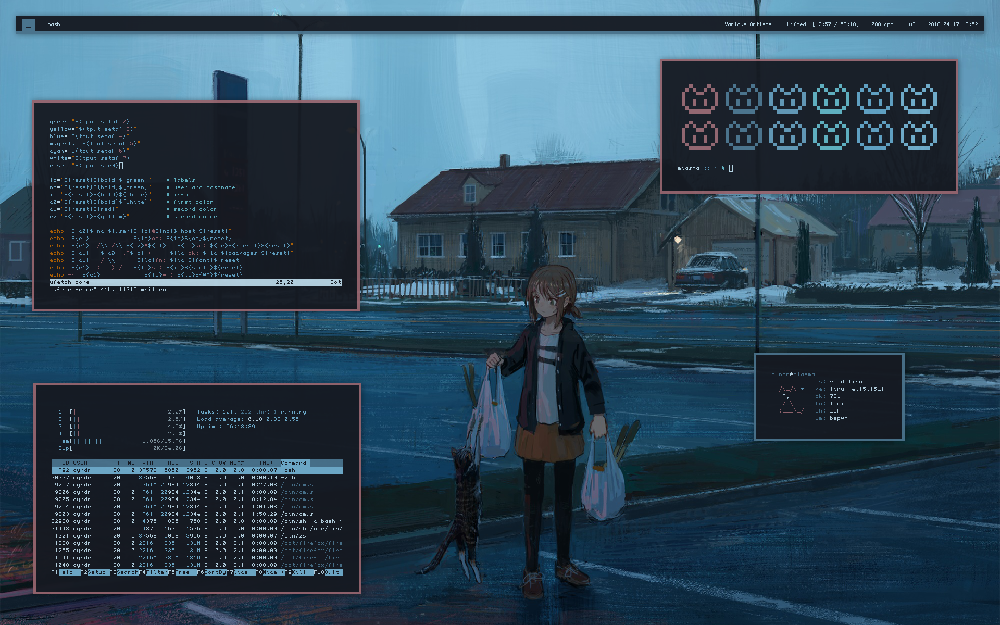
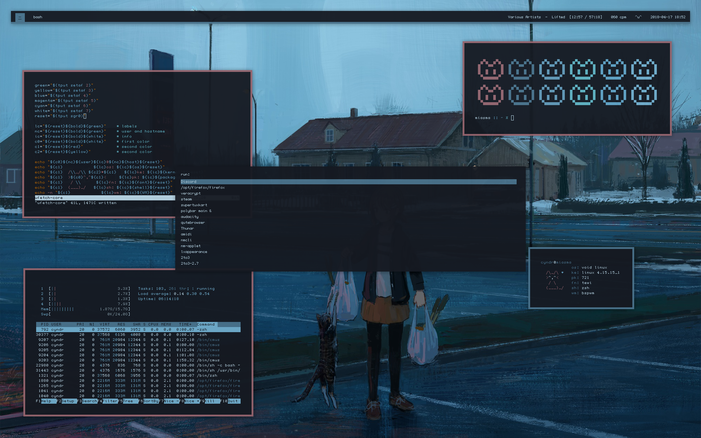

# Dotfiles
Configuration files for my linux machines, along with relevant scripts. While these try to be distro agnostic, I can't guarentee that they'll work on anything other than Void Linux. Some binds might reference my [`.scripts` directory](https://github.com/cyndrdev/bin/)

## Info
* **os**: void linux
* **terminal**: urxvt
* **wm**: bspwm
* **bar**: polybar
* **menu**: rofi
* **notifier**: dunst
* **compositor**: compton

## Screenshots
### Busy

### Busy (with launcher)

### Clean

